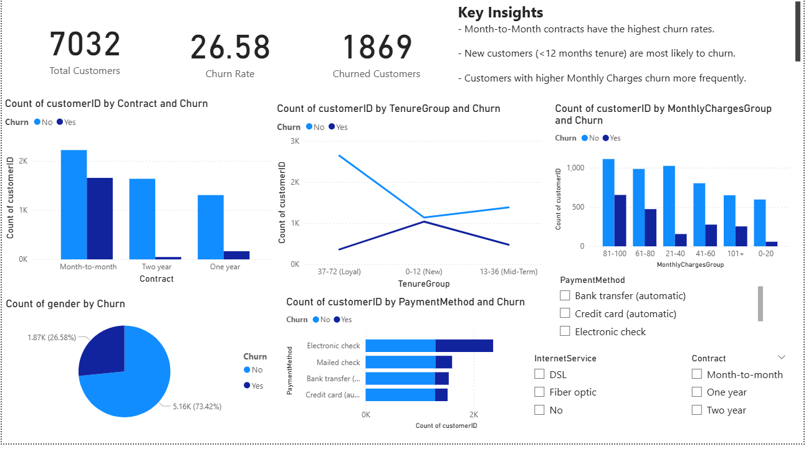

  Key Insights
- 26.6% churn rate overall (~1 in 4 customers).  
- Month-to-Month contracts** are most risky → highest churn.  
- Tenure < 12 months strongly predicts churn → onboarding phase is critical.  
- High monthly charges (> $80) correlate with churn.  
- Electronic Check payment method shows highest attrition compared to Auto-Pay.  

  Tech Stack
- Python (Pandas, NumPy, Matplotlib, Seaborn) → Data cleaning, EDA, visualization.  
- Google Colab → Notebook execution environment.  
- Power BI → Executive dashboard (KPIs, churn breakdowns, slicers).  
- GitHub → Version control, portfolio presentation.  

  Deliverables
- EDA Notebook: [churn_analysis_colab.ipynb](churn_analysis_colab.ipynb) 
- Cleaned Dataset: [TelcoChurn_Cleaned.csv](TelcoChurn_Cleaned.csv)  
- Dashboard (Power BI): [churn_dashboard.pbix](Customer_Churn_Analysis.pbix)  
- Dashboard(pdf):  
- Business Report: [churn_analysis_summary.pdf](report/churn_analysis_summary.pdf)  

  Business Recommendations
1. Incentivize long-term contracts with discounts or perks.  
2. Launch a first-year retention program to reduce early churn.  
3. Adjust pricing tiers for high-charge customers (>$80/month).  
4. Promote Auto-Pay options to replace Electronic Check payments.  
5. Engage customers with targeted campaigns in high-risk segments.  

  Why This Project Matters
This project mirrors a **real-world business problem**: customer retention.  
It demonstrates how a Data Analyst:  
1. Cleans & explores raw data.  
2. Builds visuals & dashboards for decision-makers.  
3. Translates analysis into business action with measurable impact.  

  Dashboard Preview

 Author
Aniket Sakharkar 
Data Analyst | Data Engineer | Business Insights Enthusiast  
 Email: aniketsakharkar4@gmail.com |  LinkedIn: http://www.linkedin.com/in/aniketsakharkar/   

